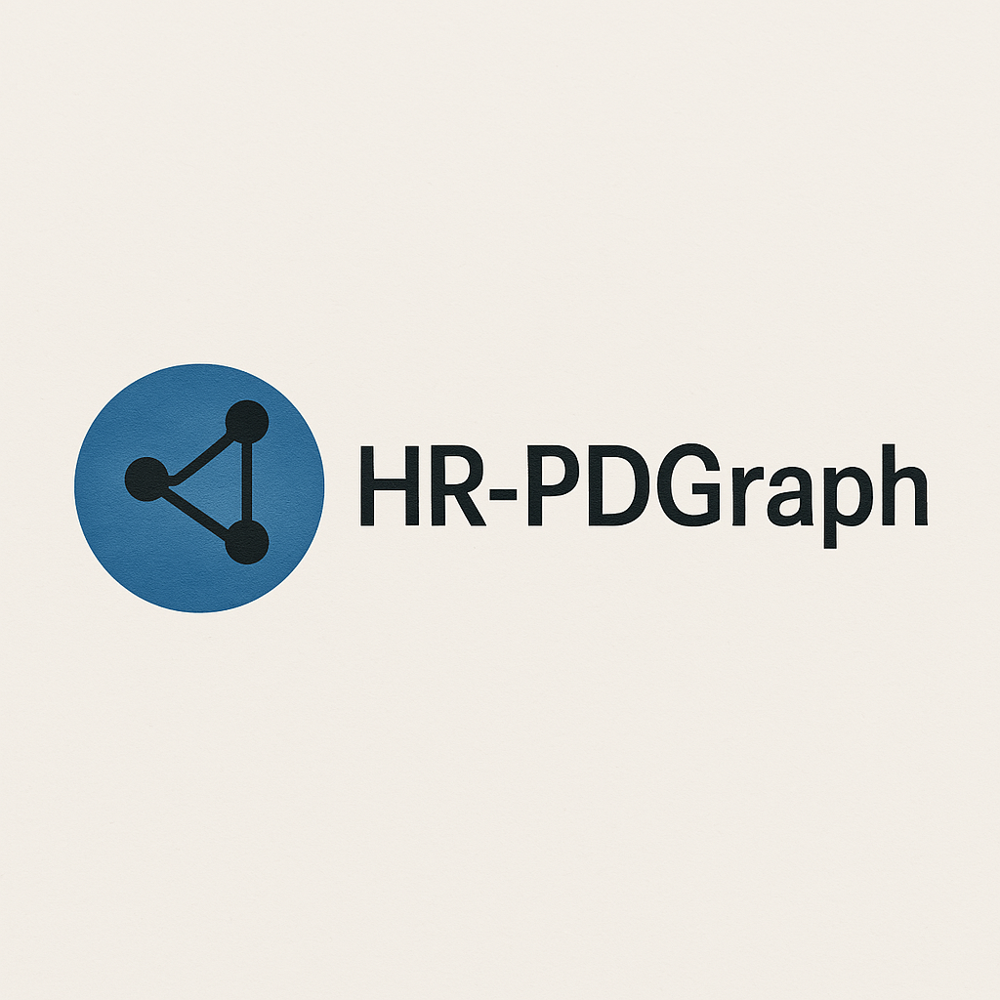

# HR-PDGraph: An analytic tool to map, evaluate, and generate position descriptions using AI and graph intelligence.

HR-PDGraph is a data-driven, explainable AI platform designed to help HR leaders and hiring stakeholders analyze, cluster, and generate position descriptions (PDs) using graph-based modeling and machine learning. By linking PDs to standardized skills (KSAs), occupations, and validated PCA-based role traits from frameworks like O*NET and VOLCANO, HR-PDGraph enables traceable scoring, role alignment, and future-ready workforce planning. The system supports transparent evaluation of new or evolving roles and provides AI-assisted PD generation to match organizational talent clusters and strategic hiring goals.

## Data

<a href="https://www.example.com">O* Net V29.0 </a>
<a href="https://github.com/juchiyu/OccupationPCAs">VOLCANA Data Generator</a>


## Project Structure

- **Data Preprocessing**: Noun phrase with textblob
- **Modeling**: embedding with sentence transformer
- **Graph Analytics**: Use Neo4j and Graph Data Science (GDS) to analyze job-role redundancies, skill overlaps, and job clusters.
- **Evaluation**: Validate results with human-annotated datasets and provide actionable recommendations.

## Installation

### Prerequisites

- Python 3.x
- Neo4j (if using Neo4j database)
- Docker (optional, if using Docker containers)
- sqlite3 (apt install)

### Set up the environment

1. Clone the repository:
    ```bash
    git clone https://github.com/your-username/ReculseNet.git
    ```

2. Navigate to the project directory:
    ```bash
    cd ReculseNet
    ```

3. Create a Python virtual environment:
    ```bash
    python -m venv venv
    ```

4. Activate the virtual environment:
    - On Windows:
        ```bash
        venv\Scriptsctivate
        ```
    - On macOS/Linux:
        ```bash
        source venv/bin/activate
        ```

5. Install required dependencies:
    ```bash
    pip install -r requirements.txt
    ```

6. Run notebooks/SQLiteSetUP

## Usage

1. Preprocess PDs and resumes to generate graph nodes and edges.
3. Apply graph metrics (e.g., Louvain, PageRank) for redundancy detection and workforce optimization.
4. Train and evaluate the Graph Neural Network for PD clustering and predictive matching.

## License

This project is licensed under the MIT License - see the [LICENSE](LICENSE) file for details.

## Acknowledgements

- Pachidi et al. (2023) for their work on transformers and O*NET for job matching.
- Neo4j for graph database management and GDS tools.
