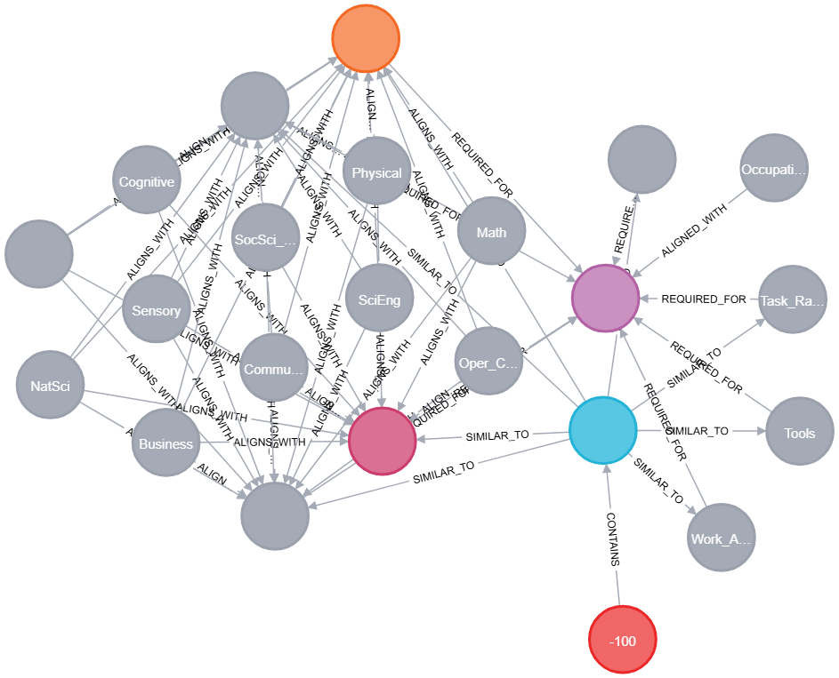

<center></center>

## Background

**FDIC HRO** seeks to automate the analysis of existing Position Descriptions (PDs) within the organization. Such analysis involves identifying overlapping PDs through shared Knowledge, Skills, and Abilities (KSA) elements. Insights derived from this analysis can support strategic initiatives like organizational restructuring, role consolidation, or gap identification.

## Objective

Develop an AI/ML-driven system that produces **verifiable, testable, and measurable models** to efficiently cluster and analyze PDs, enabling actionable insights for HR and organizational decision-makers.

Key objectives include:

- **Preprocessing** PDs and resumes to generate a graph of entities and relationships.
- **Applying graph analytics** (e.g., Louvain, PageRank) to detect redundancy and support workforce optimization.
- **Training Graph Neural Networks (GNNs)** for advanced PD clustering and predictive job-role matching.
- **Integrating Large Language Models (LLMs)** to generate role-aligned PD templates that conform to patterns learned from the organizational graph structure.

## Data Sources

### O\*NET
O\*NET (Occupational Information Network) provides a structured taxonomy of occupations, skills, knowledge, abilities, and work activities. Each occupation is associated with detailed ratings on the importance and level of various KSAs, which are critical for workforce planning and role design.

### VOLCANO
VOLCANO provides PCA-based trait scores for occupations and individual KSAs. These include:
- **Comp.1 (Preparation):** Level of preparation and complexity
- **Comp.2 (STEM vs. Humanities):** The technical vs. human-oriented balance
- **Comp.3 (Math vs. Health):** Emphasis on quantitative vs. interpersonal/health-centered work

These components allow for **quantitative, interpretable role profiling**.

### Kaggle Resume Dataset
In order to model a POC we are using 105 resumes from the kaggle resume dataset in palce of PDs. Our Assumption is that Resumes have similar KSA information as PDs and are likely more complex than PDs.

### FDIC PDs
Once the POCS is moved to an approved environment (FHPCC), we will replace the resume daataset with PDs.

## Project Proposal

**HR-PDGraph** is a data-driven, explainable AI platform designed to assist HR leaders and hiring stakeholders in analyzing, clustering, and generating position descriptions (PDs) using graph-based modeling and machine learning.

By connecting PDs to standardized skills (KSAs), occupations, and validated PCA-based role traits from frameworks such as **O\*NET** and **VOLCANO**, HR-PDGraph enables:

- Traceable scoring  
- Intelligent role alignment  
- Transparent evaluation of roles  
- AI-assisted generation of PDs aligned with strategic workforce clusters  

This proposal builds upon the methodology of the following published research:

## Research Foundations

### Research 1  
**Title:** [*A Novel Approach for Job Matching and Skill Recommendation using Transformers and the O\*NET Database*](https://www.sciencedirect.com/science/article/pii/S2214579625000048)  
**Summary:** This research presents a transformer-based approach for matching resumes to job roles by extracting entities (e.g., skills and experience) from unstructured text and computing semantic similarity scores with KSAs linked to job titles in O\*NET. The approach introduces a normalized job scoring method to rank occupations based on entity overlap and cosine similarity.

### Research 2  
**Title:** [*Visualization of Latent Components Assessed in O\*NET Occupations (VOLCANO)*](https://link.springer.com/article/10.3758/s13428-022-02044-7)  
**Summary:** This paper introduces a principal component-based approach (PCA) to analyze occupational traits. By applying dimensionality reduction to O\*NET’s rich KSA space, the authors identify interpretable latent axes such as Preparation (Comp.1), STEM vs. Humanities (Comp.2), and Math vs. Health (Comp.3). These dimensions allow for more meaningful clustering and role comparisons across the labor market.

## Leveraging the Research in Practice

We modeled the first research paper’s architecture in **Neo4j**, representing resumes, extracted entities (noun phrases), KSAs, and their associated job titles. Similarity scores between phrases and KSAs, along with job KSA importance levels, were used to dynamically compute a resume-to-job **fit score**.

We then **extended the graph** by linking each job and KSA node to the **latent PCA trait scores** from the VOLCANO study. This enriched model enables us to go beyond matching and into interpretation: we can now **cluster overlapping resumes and PDs**, and label those clusters with meaningful dimensions such as **STEM-ness, preparedness, and quantitative orientation**.

This combined approach supports **data-driven, explainable clustering** of PDs and **generative capabilities** that can help HR design roles aligned to organizational strategy.

## Encironment

Intitial POC development in the Azure Sandbox (DIT). Upon approval by stakeholders, we will move our project to FHPCC.

## Conclusion

By combining methodologies from both research papers, **HR-PDGraph** delivers a scalable and intelligent framework for organizational role analysis, grounded in graph AI and explainable machine learning.


# 🔍 HR-PD Graph: Graph-Based Resume Community Detection (Neo4j + GDS)

Welcome to Graph Data Science. This notebook documents the entire process of building a semantic graph from resumes and traits, projecting it into GDS, and running community detection + profiling.


<p>
<center>
  
  <br>
  <b>Figure 1:</b> PD Graph Schema (baseline)
</center>
</p>


***

## 1️⃣ Graph Construction Overview (Figure 1:)

We construct the graph with the following entities and relationships:

- `Resume` → [:CONTAINS] → `NounPhrase`
- `NounPhrase` → [:SIMILAR_TO] → `Skill` | `Ability` | `Knowledge` | `Work_activities`
- Each KSA node ← [:ALIGNS_WITH] ←`Trait`
- Each KSA node → [:REQUIRED_FOR] → `JobTitle`
- `Occupation` → [:ALIGNED_WITH] → `JobTitle` (from VOLCANO)

This enables multi-hop reasoning from resume → cognitive traits, allowing semantic community detection (Figure 2)


<p>
<center>
  
  <br>
  <b>Figure 2:</b> multi-hopping reasoning 
</center>
</p>

***
## 2️⃣ Project GDS Graph: Detect Resume Communities Based on Traits

To uncover hidden structure in our resume and trait data, we project a **heterogeneous graph** into the Neo4j Graph Data Science (GDS) catalog. This graph includes nodes representing:

- **Resumes**
- **Noun Phrases** extracted from resume text
- **O*NET-style traits** such as Skills, Knowledge, Abilities, and Work Activities
- **Custom job traits** from the VOLCANO dataset

#### 🔗 Node Types

- `Resume`: Parsed resume documents
- `NounPhrase`: Extracted phrases representing capabilities
- `KSA`: O*NET-style Skills, Knowledge, and Abilities
- `Trait`: Supplementary traits (e.g., from VOLCANO or behavioral models)
- `JobTitle`: Standardized job roles
- `Occupation`: Broader occupational categories (SOC codes)

#### 📦 Graph Projection Code

We define the graph projection by specifying relevant node labels and relationship types, all as **undirected** to allow GDS algorithms to walk in both directions. The graph projection makes these relationships available in the GDS engine for advanced analytics.

```cypher
CALL gds.graph.drop('resume_trait_graph', false);  // optional: clean slate

CALL gds.graph.project(
  'resume_trait_graph',
  ['Resume', 'NounPhrase', 'Knowledge', 'Skill', 'Ability', 'Trait', 'JobTitle', 'Occupation'],
  {
    CONTAINS: {orientation: 'UNDIRECTED'},
    SIMILAR_TO: {orientation: 'UNDIRECTED'},
    ALIGNS_WITH: {orientation: 'UNDIRECTED'},
    REQUIRED_FOR: {orientation: 'UNDIRECTED'}
  }
);


```
***

## 3️⃣ Run Louvain Community Detection

With the graph projected, we apply Louvain community detection, a powerful unsupervised algorithm that finds clusters (or “communities”) of nodes that are densely interconnected. This algorithm identifies groups of resumes and traits that share common semantic features, enabling deeper understanding of:

- Workforce patterns

- Emerging talent clusters

- Trait-driven job readiness

```cypher
CALL gds.louvain.write('resume_trait_graph', {
  writeProperty: 'community_id'
})
YIELD communityCount, modularity;
```

**Expected Output:**
- `communityCount`: e.g. `433`
- `modularity`: e.g. `0.05` (very good separation)

***

## 4️⃣ List Detected Communities


```cypher
MATCH (r:Resume)
RETURN DISTINCT r.community_id AS cluster_id
ORDER BY cluster_id limit 5;
```
### 🧭 Detected Resume-Trait Communities

A total of 130 communities were identified using the Louvain algorithm on the projected resume-trait graph. Each represents a cluster of resumes, traits, and occupations that are semantically aligned based on shared KSAs and relationships. List shows the first 5 in Table 1.

| Community ID |
|--------------|
| 770          |
| 771          |
| 776          |
| 782          |
| 785          |


<center><b>Table 1:</b> An example of 5 (out of of 433) communities listed </center>


## 5️⃣ Profile Trait Dimensions by Cluster

To understand the psychological and functional traits that define each cluster of resumes, we aggregate **PCA-based trait dimensions** from the VOLCANO model across resumes in each community. The dimensions—**Cognitive**, **Operational**, and **Physical**—are averaged to generate a cluster-level profile.

The Cypher query below performs this aggregation:

```cypher
MATCH (r:Resume)-[:CONTAINS]->(:NounPhrase)-[:SIMILAR_TO]->(e)<-[:ALIGNS_WITH]-(t:Trait)
WHERE r.community_id IS NOT NULL
WITH r.community_id AS cluster,
     avg(t.score1) AS cognitive,
     avg(t.score2) AS operational,
     avg(t.score3) AS physical
RETURN cluster, cognitive, operational, physical
ORDER BY cluster;
```

This gives PCA-based cluster characteristics from the VOLCANO trait model.

***

## 6️⃣ Cluster Labeling Strategy (Heuristics)

The table below shows the resulting **trait profile centroids** for each cluster. These values represent the average PCA-based trait scores derived from the VOLCANO model across resumes in each cluster.


| Cluster ID | Cognitive Score | Operational Score | Physical Score |
|------------|------------------|--------------------|-----------------|
| 115        | 10.9352          | -2.2246            | 2.9188          |
| 209        | 0.3867           | 29.3248            | 7.4143          |
| 225        | 6.8815           | -1.6991            | 0.2173          |
| 313        | 3.5523           | -0.1375            | 1.4713          |
| 315        | -2.0129          | -0.0441            | 0.5987          |
| 318        | 11.7481          | -0.1450            | 0.3690          |
| 320        | 6.2521           | 3.4427             | 1.5596          |
| 323        | 3.0265           | -0.6751            | -0.4912         |
| 338        | 7.3864           | -2.8181            | 1.3220          |
| 339        | 4.3055           | 0.4521             | 1.7081          |
| 340        | 8.9931           | -8.0314            | 2.3561          |
| 372        | 5.0704           | -0.3317            | 1.6210          |
| 375        | 11.3882          | -1.8373            | 0.1332          |
| 377        | 7.7998           | 0.1773             | -0.1820         |
| 393        | 8.1728           | -2.3099            | 2.5013          |
| 407        | 6.5870           | 0.3343             | 0.3792          |
| 433        | 14.1226          | -0.2672            | 4.6392          |
| 437        | -0.0771          | 4.7277             | 4.1728          |


<center><b>Table 2: </B>Resume Communities with their respective Average Traits scores</b></center>


### 💡 Interpretation Heuristics

Based on the dominant trait dimension(s) in Table 2, we can label clusters heuristically:

- **Cognitive-Dominant**: High cognitive score, low operational and physical (e.g., Cluster 433)
- **Operational-Heavy**: Very high operational score (e.g., Cluster 209)
- **Balanced**: Moderate scores across dimensions (e.g., Cluster 339)
- **Low Activity Profiles**: Negative or near-zero values (e.g., Cluster 315)

These labels help summarize the psychological and functional makeup of groups of resumes, which can then inform job fit, training priorities, or hiring strategies.


We use simple rules to label communities based on trait averages:

| Label                 | Criteria                                 |
|----------------------|-------------------------------------------|
| STEM-heavy           | `cognitive ≥ 10`, `operational ≤ 0`       |
| Operational/Admin    | `operational ≥ 4`                         |
| Physical/Trade       | `physical ≥ 2.5`                          |
| Generalist           | All values between 2–8                   |
| Creative/Outlier     | `cognitive > 12` or unusual combinations  |

<center><b>Table 3: </B>A Labeling rules for this project</b></center>

Each resume is assigned a `community_label`.

---

## 7️⃣ Apply Labels in Neo4j


```cypher
MATCH (r:Resume)
WHERE r.community_id = 433
SET r.community_label = "STEM-heavy";
```

Repeat for each cluster.

***


## 8️⃣ Visualize in Neo4j Bloom

- Color `Resume` nodes by `community_label`
- Query:
  ```cypher
  MATCH (r:Resume)-[:CONTAINS]->(:NounPhrase)-[:SIMILAR_TO]->()-[:ALIGNS_WITH]->(t:Trait)
  RETURN r, t
  ```
- Export PNGs for clusters of interest
<p>
<center>
  
  <br>
  <b>Figure 3:</b> A Stem Heavy Cluster
</center>
</p>


---


```python
from IPython.display import display, HTML

from IPython.display import display, HTML

def show_two_samples(title1, text1, title2, text2):
    display(HTML(f"""
    <div style="display: flex; gap: 20px; font-family: 'Segoe UI', sans-serif;">
        <div style="
            flex: 1;
            border: 1px solid #ccc;
            background-color: #f9f9f9;
            padding: 12px;
            border-left: 5px solid #2b6cb0;
        ">
            <strong style="color: #2b6cb0;">{title1}</strong>
            <pre style="white-space: pre-wrap; margin: 10px 0 0 0;">{text1}</pre>
        </div>
        <div style="
            flex: 1;
            border: 1px solid #ccc;
            background-color: #f9f9f9;
            padding: 12px;
            border-left: 5px solid #38a169;
        ">
            <strong style="color: #38a169;">{title2}</strong>
            <pre style="white-space: pre-wrap; margin: 10px 0 0 0;">{text2}</pre>
        </div>
    </div>
    """))
show_two_samples(
    "Resume Snippet 1 (Operational)",
    "Education Details January 2018 M. S. Nutrition and Exercise Physiology New York, NY Teachers College, Columbia University January 2016 B. S. Nutrition and Dietetics Miami, FL Florida International University January 2011 B. Sc. General Microbiology Pune, Maharashtra Abasaheb Garware College Group Fitness Instructor, India Group Fitness Instructor, India - Columbia University Skill Details Company Details company - Columbia University description - Present Organized high energy weight training, cardiovascular and indoor cycling classes accommodating participants of varying age-groups, cultural backgrounds and fitness levels to help achieve their fitness goals. company - Columbia Dental School description - Provided detailed nutrition counselling and telephonic follow up to dental patients with accompanying metabolic conditions like diabetes, hypertension and obesity. ",    
    "Resume Snippet 2 (STEM-heavy)",
    "echnical Skills Application Servers: IIS 6. 0, Jboss 7. 1. Database: SQL, Oracle and DB2. Report Tool: iReport, Crystal report. Career GraphEducation Details Business Analyst Business Analyst - Zensar Technologies Ltd Skill Details CRYSTAL REPORT- Exprience - 15 months DATABASE- Exprience - 6 months DB2- Exprience - 6 months IIS- Exprience - 6 months IIS 6- Exprience - 6 monthsCompany Details company - Zensar Technologies Ltd description - Location: Goregoan, Mumbai ( Client -SUN Pharmaceutical ) Designation: Business Analyst. Role: Requirement gathering, gap analysis, support, end user training, documentation. company - Proteus Technologies Pvt Ltd description - Base Information Management Pvt. Ltd. Is a Mumbai base software service provider with core competency and proven track record of installations of Enterprise Wide Solutions."
)

```


<div style="display: flex; gap: 20px; font-family: 'Segoe UI', sans-serif;">
    <div style="
        flex: 1;
        border: 1px solid #ccc;
        background-color: #f9f9f9;
        padding: 12px;
        border-left: 5px solid #2b6cb0;
    ">
        <strong style="color: #2b6cb0;">Resume Snippet 1 (Operational)</strong>
        <pre style="white-space: pre-wrap; margin: 10px 0 0 0;">Education Details January 2018 M. S. Nutrition and Exercise Physiology New York, NY Teachers College, Columbia University January 2016 B. S. Nutrition and Dietetics Miami, FL Florida International University January 2011 B. Sc. General Microbiology Pune, Maharashtra Abasaheb Garware College Group Fitness Instructor, India Group Fitness Instructor, India - Columbia University Skill Details Company Details company - Columbia University description - Present Organized high energy weight training, cardiovascular and indoor cycling classes accommodating participants of varying age-groups, cultural backgrounds and fitness levels to help achieve their fitness goals. company - Columbia Dental School description - Provided detailed nutrition counselling and telephonic follow up to dental patients with accompanying metabolic conditions like diabetes, hypertension and obesity. </pre>
    </div>
    <div style="
        flex: 1;
        border: 1px solid #ccc;
        background-color: #f9f9f9;
        padding: 12px;
        border-left: 5px solid #38a169;
    ">
        <strong style="color: #38a169;">Resume Snippet 2 (STEM-heavy)</strong>
        <pre style="white-space: pre-wrap; margin: 10px 0 0 0;">echnical Skills Application Servers: IIS 6. 0, Jboss 7. 1. Database: SQL, Oracle and DB2. Report Tool: iReport, Crystal report. Career GraphEducation Details Business Analyst Business Analyst - Zensar Technologies Ltd Skill Details CRYSTAL REPORT- Exprience - 15 months DATABASE- Exprience - 6 months DB2- Exprience - 6 months IIS- Exprience - 6 months IIS 6- Exprience - 6 monthsCompany Details company - Zensar Technologies Ltd description - Location: Goregoan, Mumbai ( Client -SUN Pharmaceutical ) Designation: Business Analyst. Role: Requirement gathering, gap analysis, support, end user training, documentation. company - Proteus Technologies Pvt Ltd description - Base Information Management Pvt. Ltd. Is a Mumbai base software service provider with core competency and proven track record of installations of Enterprise Wide Solutions.</pre>
    </div>
</div>


## 🔄 Analyze Centrality or Similarity Using PageRank

After projecting the `resume_trait_graph`, we can apply **PageRank** to identify the most central and influential resumes in the graph.

### 📌 What Is PageRank?

**PageRank** is a centrality algorithm originally developed by Google to rank web pages. It measures the importance of a node based on the quantity and quality of its connections.

In the context of our graph:

- A **Resume** node with a high PageRank score is **highly connected** to influential traits or shares traits with many other resumes.
- A **Trait** or **KSA** node with high PageRank is connected to multiple resumes, job titles, or occupations — making it a **common or valuable capability**.

### 🧠 Why This Matters

PageRank helps us:

- **Identify generalist resumes** with broadly relevant or in-demand capabilities.
- **Rank traits** by their influence across occupations and resumes.
- Spot **hidden influencers**: resumes or traits that aren’t obviously connected but are structurally important in the network.
- Generate **better recommendations** (e.g., resumes to job matches, traits to prioritize).

This adds a layer of **graph-based insight** that complements community detection and trait profiling.

***

### 🛠️ Run PageRank in Neo4j GDS

We can apply the PageRank algorithm to our projected graph using the following Cypher command:

```cypher
CALL gds.pageRank.write('resume_trait_graph', {
  maxIterations: 20,
  dampingFactor: 0.85,
  writeProperty: 'pagerank'
});
```
<center></center>
<center><b>Figure 4:</b> Example of most common Traits: Sensor, Communication, Education and Training, etc. </center>

***

## ✅ Outcome

You now have:

- Trait-aware semantic clusters of resumes
- Trait PCA signatures per cluster
- Community labels like "STEM", "Ops", etc.
- Resume-trait-occupation alignment
- Graph structure suitable for further querying, filtering, and recommendation

***
